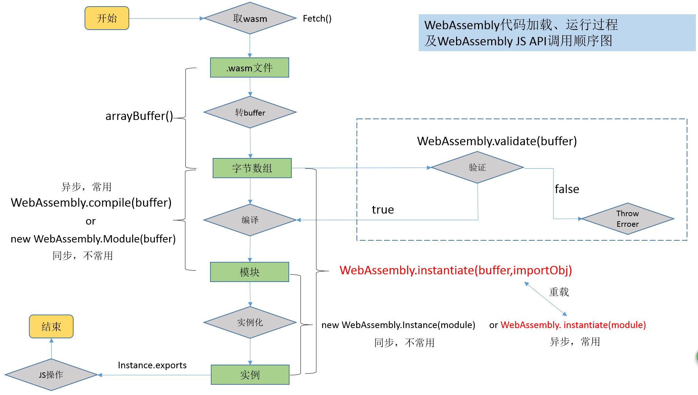

补充文件

## WebAssembly介绍
[WebAssembly介绍](https://segmentfault.com/a/1190000011192911)

浏览器可直接执行的.wasm文件 和.wast可阅读的S-表达式文件  
使用 [wabt](https://github.com/WebAssembly/wabt) 转换  

浏览器中的执行步骤和api:  
require .wasm文件 -> 转arrayBuffor -> 编译 -> 实例化  

### WebAssembly工具集

- emscripten:是基于LLVM的一系列编译工具的集合 c/c++ 编译成wasm
- Binaryen：一套更为全面的工具链 和Emscripten集成
- WABT工具包：支持将二进制WebAssembly格式转换为可读的S表达式文件，含有 wasm2wast 和 wast2wasm 工具

- [webassembly.studio](https://webassembly.studio/)工具

- WebAssembly.Instance 
    - 同步的
    - new WebAssembly.Instance()
    - 传入buffer和imports对象同时编译的和实例化  
      或者 传模块对象和imports对象，这种调用只完成实例化
- WebAssembly.instantiate
  - 异步的
  - 类似 传模块对象和imports对象，这种调用只完成实例化 功能

### 基于WebAssembly的ammo.js 物理引擎
threejs绘图 ammo.js 计数刚体力学环境
